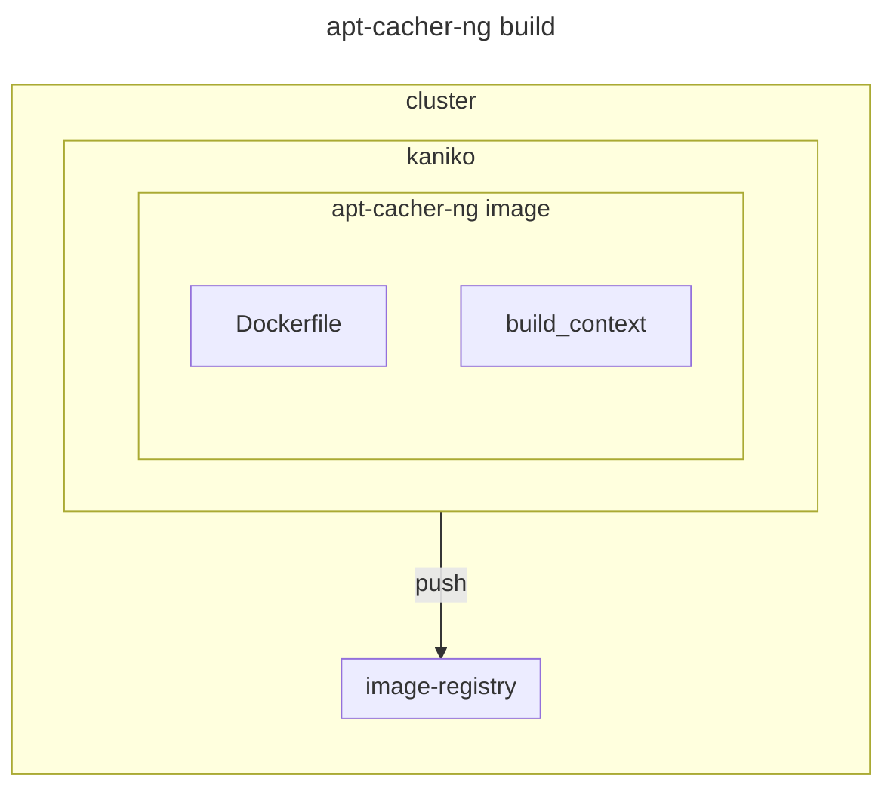
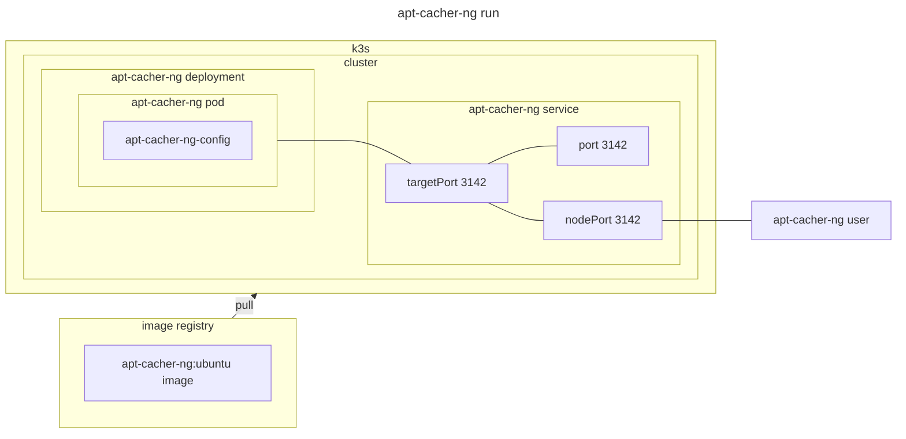

# apt-cacher-ng

## environment





## prerequiste

### [image-registry](../image-registry/)

- for push registry
  - image-registry.default.svc.cluster.local:65000
- for pull registry
  - localhost:65000

### [k3s](../k3s)

`/etc/rancher/k3s/registries.yaml`

```sh
configs:
  "localhost:65000":
    tls:
      insecure_skip_verify: true
```

reflect

```sh
sudo systemctl restart k3s
```

### [kaniko](../kaniko)

## build

```sh
tar -C build_context/ -cf - Dockerfile | gzip -9 | \
kubectl run kaniko --rm --stdin=true --image=gcr.io/kaniko-project/executor:latest \
--restart=Never \
-- --dockerfile=./Dockerfile --context=tar://stdin \
--destination=image-registry.default.svc.cluster.local:65000/apt-cacher-ng:ubuntu \
--insecure \
--insecure-registry=image-registry.default.svc.cluster.local:65000
```

## setup

```sh
kubectl apply -k .
```

## teardown

```sh
kubectl delete -k .
```

## prune

```sh
kubectl apply -k . --prune -l app=apt-cacher-ng --prune-allowlist core/v1/ConfigMap
```
