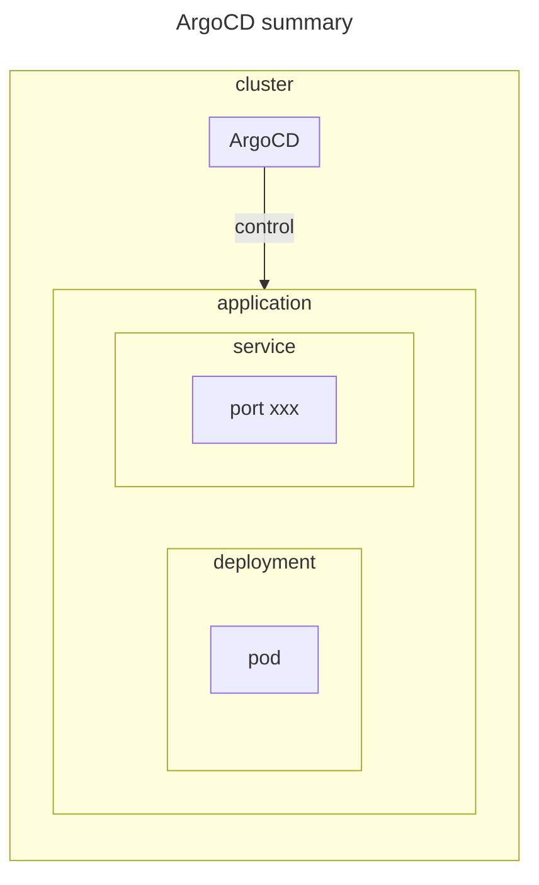

# argocd

## environment



## prerequisite

- [k3s](../k3s)

## documentation

[ArgoCD を使ってみた！](https://qiita.com/masamokkulu/items/e725113706a719175ae6)

## setup

```sh
# wget https://raw.githubusercontent.com/argoproj/argo-cd/stable/manifests/install.yaml
kubectl apply -k .
```

## teardown

```sh
kubectl delete -k .
```
