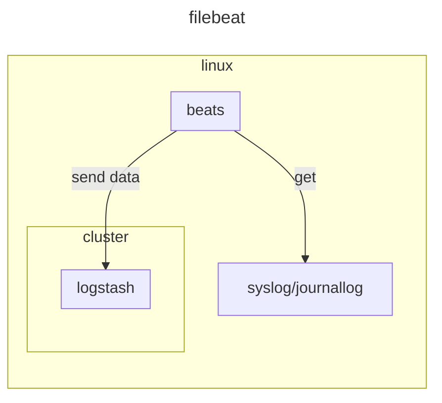

# filebeat

## environment



## documentation

- [filebeat-installation-configuration](https://www.elastic.co/docs/reference/beats/filebeat/filebeat-installation-configuration)
- [filebeat keystore](https://www.elastic.co/docs/reference/beats/filebeat/keystore)

## prerequisite

- [elasticsearch](../elasticsearch)
- [logstash](../logstash)

## setup

### setup filebeat

#### install filebeat

```sh
curl -L -O https://artifacts.elastic.co/downloads/beats/filebeat/filebeat-9.0.0-amd64.deb
sudo dpkg -i filebeat-9.0.0-amd64.deb
```

#### create keystore

```sh
# get elastic user key
kubectl get secret elasticsearch-es-elastic-user -o=jsonpath='{.data.elastic}' | base64 --decode; echo

# creat keystore
sudo filebeat keystore create
sudo filebeat keystore add ES_PWD
```

#### enable system module

```sh
sudo filebeat modules list
sudo filebeat modules enable system
```

`/etc/filebeat/modules.d/system.yml`

```sh
- module: system
  syslog:
    enabled: true
    var.user_journald: true
```

#### setup for elasticsearch

`/etc/filebeat/filebeat.yml`

```sh
output.elasticsearch:
  hosts: ["localhost:9200"]
  protocol: "https"
  username: "elastic"
  password: "${ES_PWD}"
  ssl.verification_mode: none
#output.logstash:
#  hosts: ["localhost:5044"]
..
setup.kibana:
  host: "localhost:5601"
  protocol: "https"
  username: "elastic"
  password: "${ES_PWD}"
  ssl.verification_mode: none
```

```sh
sudo filebeat setup -e --pipelines --dashboards -v
```

#### setup for logstash

`/etc/filebeat/filebeat.yml`

```sh
#output.elasticsearch:
#  hosts: ["localhost:9200"]
#  protocol: "https"
#  username: "elastic"
#  password: "${ES_PWD}"
#  ssl.verification_mode: none
output.logstash:
  hosts: ["localhost:5044"]
```

```sh
sudo filebeat setup -e --pipelines -v
```

### enable filebeat

```sh
sudo systemctl enable --now filebeat
```

## teardown

```sh
sudo dpkg --purge filebeat-9.0.0-amd64.deb
```
