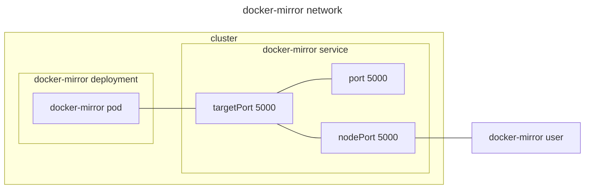

# docker-mirror

## environment


```mermaid
---
title: docker-mirror network
---
graph LR;
subgraph cluster[cluster]
    direction TB;
    subgraph deploy[docker-mirror deployment]
        pod[docker-mirror pod]
    end
    pod --- targetPort[targetPort 5000]
    subgraph service[docker-mirror service]
        targetPort --- port[port 5000]
        targetPort --- nodePort[nodePort 5000]
    end
end
    nodePort --- user[docker-mirror user]
```

## prerequisite

- [k3s](../k3s)

## setup

```sh
kubectl apply -f docker-mirror.yaml
```

## teardown

```sh
kubectl delete -f docker-mirror.yaml
```
