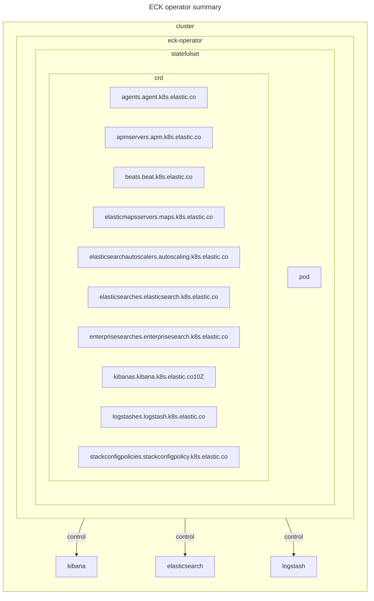

# ECK (Elastic Cloud on Kubernetes) operator

## documentation

- [Install ECK using the YAML manifests](https://www.elastic.co/docs/deploy-manage/deploy/cloud-on-k8s/install-using-yaml-manifest-quickstart)
- [Elastic Cloud on Kubernetes](https://www.elastic.co/docs/deploy-manage/deploy/cloud-on-k8s)

## environment



## setup

```sh
# setup crd
# https://download.elastic.co/downloads/eck/3.0.0/crds.yaml
kubectl create -f crds.yaml

# install operator
# https://download.elastic.co/downloads/eck/3.0.0/operator.yaml
kubectl apply -f operator.yaml
```

## teardown

```sh
# uninstall operator
kubectl delete -f operator.yaml

# teardown crd
kubectl delete -f crds.yaml
```
