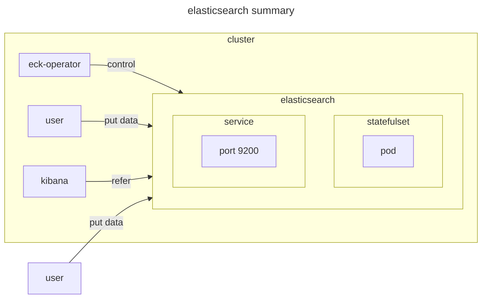

# elasticsearch

## documentation

- [doc](https://www.elastic.co/docs/deploy-manage/deploy/cloud-on-k8s/elasticsearch-deployment-quickstart)
- [doc k8s logstash config custom index](https://www.elastic.co/docs/deploy-manage/deploy/cloud-on-k8s/configuration-examples-logstash#k8s-logstash-configuration-custom-index)
  - `https://github.com/elastic/cloud-on-k8s/blob/main/config/recipes/logstash/logstash-es-role.yaml`

## environment



## prerequiste

- [eck-operator](../eck-operator)

## setup

```sh
# install elasticsearch
kubectl apply -f elasticsearch.yaml

# get access
PASSWORD=$(kubectl get secret elasticsearch-es-elastic-user -o go-template='{{.data.elastic | base64decode}}')
curl -u "elastic:$PASSWORD" -k "https://localhost:9200"
```

## teardown

```sh
# uninstall elasticsearch
kubectl delete -f elasticsearch.yaml
```