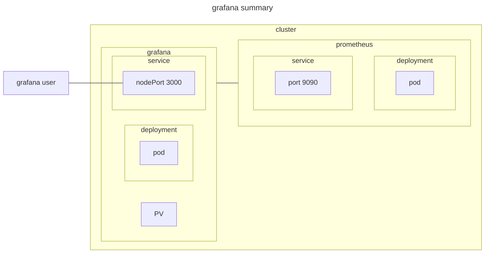

# grafana

## documentation

[ローカルKubernetesクラスター上でPrometheusのメトリクスをGrafanaダッシュボードで可視化する](https://zenn.dev/ring_belle/articles/prometheus-grafana-metrics)

## environment



## setup

1. start server

    ```sh
    kubectl apply -f grafana.yaml
    ```

1. connect prometheus

   - `Home->Connections->Add new connection->Prometheus`
     - Prometheus server URL
       - `http://prometheus:9090`
