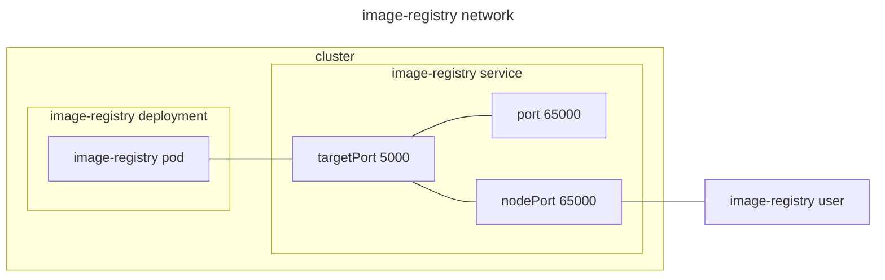

# image-registry

## environment


```mermaid
---
title: image-registry network
---
graph LR;
subgraph cluster[cluster]
    direction TB;
    subgraph deploy[image-registry deployment]
        pod[image-registry pod]
    end
    pod --- targetPort[targetPort 5000]
    subgraph service[image-registry service]
        targetPort --- port[port 65000]
        targetPort --- nodePort[nodePort 65000]
    end
end
    nodePort --- user[image-registry user]
```

## prerequisite

- [k3s](../k3s)

## setup

```sh
kubectl apply -f image-registry.yaml
```

## teardown

```sh
kubectl delete -f image-registry.yaml
```
