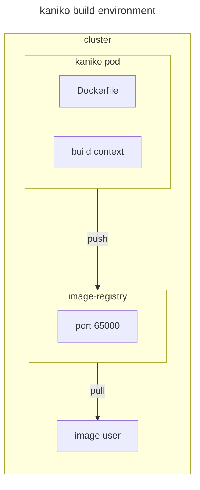

# kaniko

## documentation

[kaniko](https://github.com/GoogleContainerTools/kaniko)

## environment



## usage

### use Dockerfile with build_context

```sh
tar  -C build_context/ -cf - Dockerfile | gzip -9 | \
kubectl run kaniko --rm --stdin=true --image=gcr.io/kaniko-project/executor:latest \
--restart=Never \
-- --dockerfile=./Dockerfile --context=tar://stdin \
--destination=image-registry.default.svc.cluster.local:65000/test:v1 --insecure \
--insecure-registry=image-registry.default.svc.cluster.local:65000
```

### use Dockerfile with build_context on hostnetwork

```sh
tar -C build_context/ -cf - Dockerfile | gzip -9 | \
kubectl run kaniko --rm --stdin=true --image=gcr.io/kaniko-project/executor:latest \
--restart=Never \
--overrides='{"kind":"Pod", "apiVersion":"v1", "spec": {"hostNetwork":true}}' \
-- --dockerfile=./Dockerfile --context=tar://stdin \
--destination=localhost:65000/test:v1 --insecure \
--insecure-registry=localhost:65000
```
