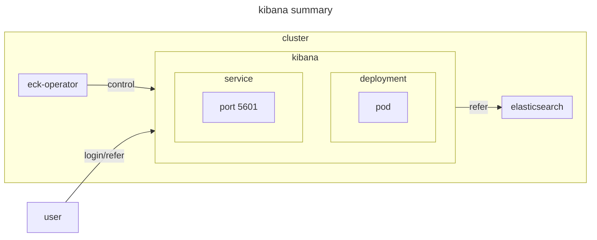

# kibana

## documentation

- [kibana-instance-quickstart](https://www.elastic.co/docs/deploy-manage/deploy/cloud-on-k8s/kibana-instance-quickstart)

## environment



## setup

```sh
# install kibana
kubectl apply -f kibana.yaml

# get elastic user password
kubectl get secret elasticsearch-es-elastic-user -o=jsonpath='{.data.elastic}' | base64 --decode; echo

# login
https://localhost:5601
```

## teardown

```sh
# uninstall kibana
kubectl delete -f kibana.yaml
```
