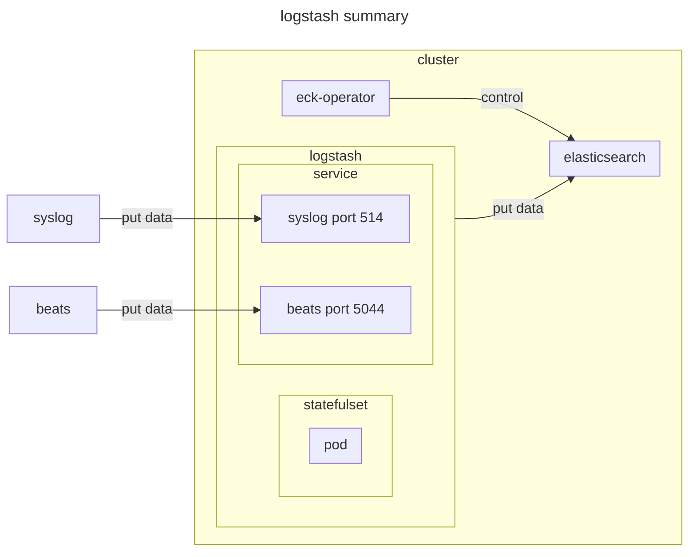
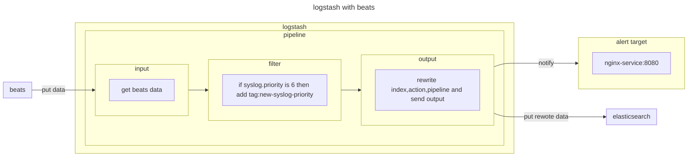
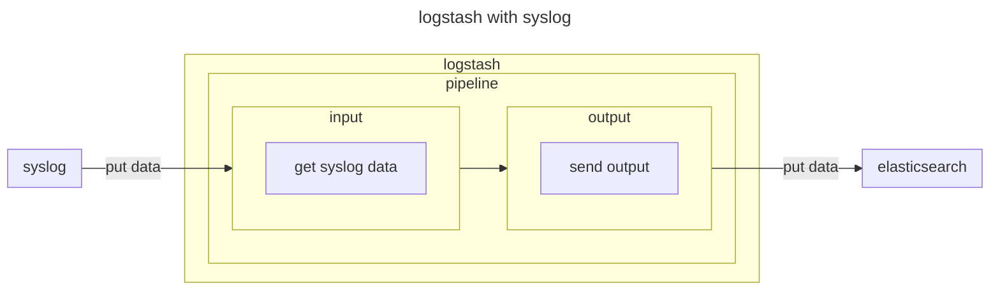

# logstash

## documentation

- [quickstart-logstash](https://www.elastic.co/docs/deploy-manage/deploy/cloud-on-k8s/quickstart-logstash)
- [configuration-logstash](https://www.elastic.co/docs/deploy-manage/deploy/cloud-on-k8s/configuration-logstash)
- [k8s-logstash-configuration-custom-index](https://www.elastic.co/docs/deploy-manage/deploy/cloud-on-k8s/configuration-examples-logstash#k8s-logstash-configuration-custom-index)
  - eck_release_branch : v3.0.0

## environment







## prerequisite

- [eck-operator](../eck-operator)
- [elasticsearch](../elasticsearch/)

## setup

```sh
kubectl apply -k .
```

## teardown

***elasticsearch is also deleted.***

```sh
kubectl delete -k .
```

## prune

```sh
kubectl apply -k . --prune -l name=logstash --prune-allowlist core/v1/Secret
```

## appendix

### errors in logstash to connect filebeat

```sh
# error message
## action [indices:data/write/bulk[s]] is unauthorized for user [default-logstash-default-elasticsearch-logstash-user] with effective roles [eck_logstash_user_role] on indices [filebeat-9.0.0], this action is granted by the index privileges [create_doc,create,delete,index,write,all]"}}

# confirm current role
kubectl exec -it elasticsearch-es-default-0 -- sh
grep eck_logstash_user_role /mnt/elastic-internal/xpack-file-realm/roles.yml -A 26

# append additional role by command
elasticsearch-users  roles -a superuser default-logstash-default-elasticsearch-logstash-user
```

### elasticsearch realm type

- this is file based realm by specifying secret as user
  - https://www.elastic.co/docs/deploy-manage/users-roles/cluster-or-deployment-auth/file-based
