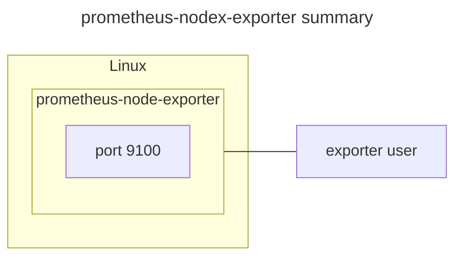

# prometheus-node-exporter

## environment


```mermaid
---
title: prometheus-nodex-exporter summary
---
graph LR;
subgraph Linux
    subgraph exporter[prometheus-node-exporter]
        poort[port 9100]
    end
end
exporter --- user[exporter user]
```

## setup

```sh
sudo apt install -y prometheus-node-exporter
```
