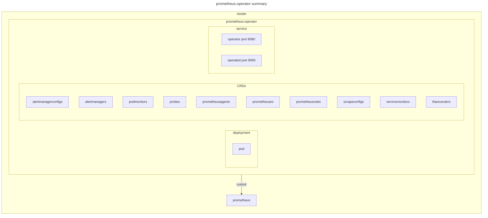

# prometheus-operator

## documentation

- [prometheus official procedure](https://grafana.com/docs/grafana-cloud/monitor-infrastructure/kubernetes-monitoring/configuration/config-other-methods/prometheus/prometheus-operator/)
- [prometheus-operator official](https://prometheus-operator.dev/)
- [prometheus-operator github](https://github.com/prometheus-operator/prometheus-operator/tree/main)

## environment



## setup

[ローカルKubernetesクラスター上でPrometheusのメトリクスをGrafanaダッシュボードで可視化する](https://zenn.dev/ring_belle/articles/prometheus-grafana-metrics)

```sh
# install prometheus operator
kubectl create -f bundle.yaml

# setup prometheus operator rbac
kubectl apply -f prometheus_rbac.yaml
```

## teardown

```sh
# teardown prometheus operator rbac
kubectl delete -f prometheus_rbac.yaml

# uninstall prometheus operator
kubectl delete -f bundle.yaml
```
