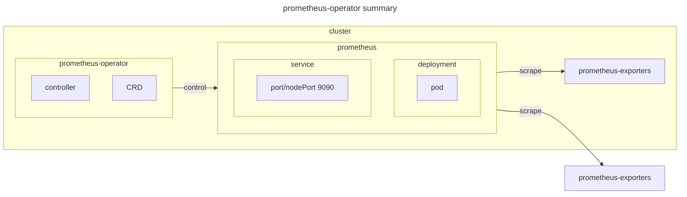
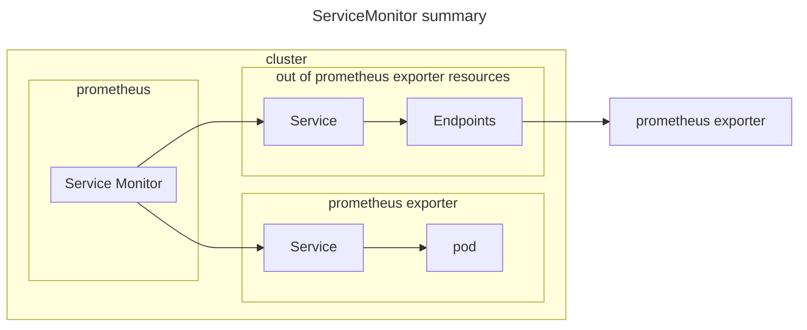
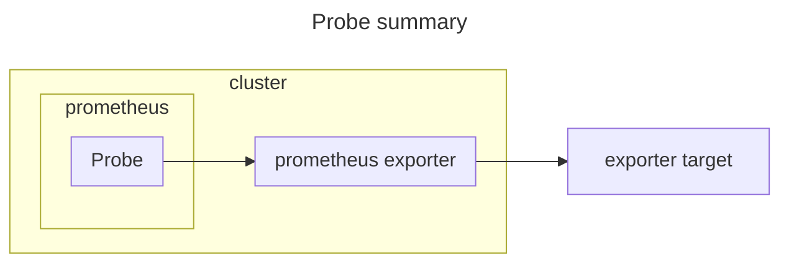

# prometheus

## documentation

[prometheus-operator getting-started.md](https://github.com/prometheus-operator/prometheus-operator/blob/main/Documentation/developer/getting-started.md)
[prometheus-operator API](https://prometheus-operator.dev/docs/api-reference/api/)

## environment



## prerequisite

[prometheus-operator](../prometheus-operator/)

## setup

[ローカルKubernetesクラスター上でPrometheusのメトリクスをGrafanaダッシュボードで可視化する](https://zenn.dev/ring_belle/articles/prometheus-grafana-metrics)

### prometheus CRD

```sh
kubectl apply -f prometheus.yaml
```

### ServiceMonitor CRD

#### ServiceMonitor environment



#### in cluster

##### in cluster example

scrape prometheus-self

```sh
kubectl apply -f prometheus-servicemonitor-incluster-prometheus-self.yaml
```

#### out of cluster

##### out of cluster example

scrape prometheus-node-exporter

```sh
sed -i 's/SCRAPE_TARGET_IP/a.b.c.d/g' prometheus-servicemonitor-outcluster-prometheus-node-exporter.yaml
kubectl apply -f prometheus-servicemonitor-outcluster-prometheus-node-exporter.yaml
```

### Probe CRD

#### Probe environment



#### Probe example

scrape blackbox-exporter as ssh_probe

```sh
kubectl apply -f prometheus-probe-blackbox-exporter.yaml
```
