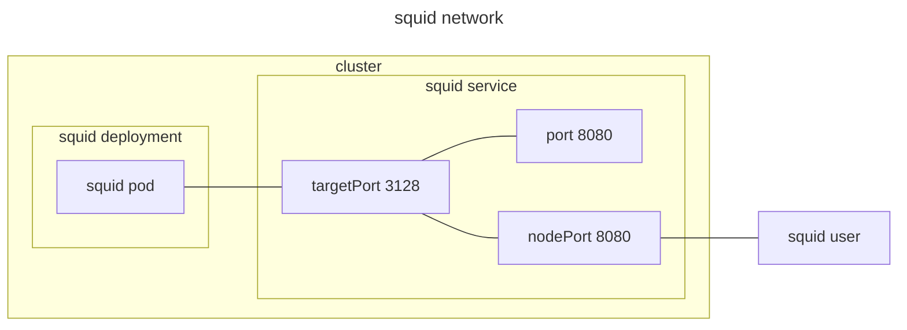

# squid

## environment


```mermaid
---
title: squid network
---
graph LR;
subgraph cluster[cluster]
    direction TB;
    subgraph deploy[squid deployment]
        pod[squid pod]
    end
    pod --- targetPort[targetPort 3128]
    subgraph service[squid service]
        targetPort --- port[port 8080]
        targetPort --- nodePort[nodePort 8080]
    end
end
    nodePort --- squidUser[squid user]
```

## setup

```sh
kubectl apply -f squid.yaml
```

## teardown

```sh
kubectl delete -f squid.yaml
```
