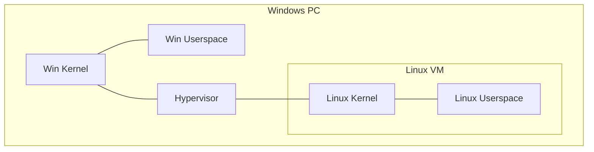

# Windows Subsystem for Linux (wsl)

## 目次

- [Windows Subsystem for Linux (wsl)](#windows-subsystem-for-linux-wsl)
  - [目次](#目次)
  - [資料](#資料)
  - [環境](#環境)
    - [スペック](#スペック)
    - [関係図](#関係図)
  - [setup](#setup)
    - [install Linux (Debian) VM](#install-linux-debian-vm)
    - [setup global configuration](#setup-global-configuration)
    - [start Debian](#start-debian)
    - [setup local configuration](#setup-local-configuration)
    - [reflect](#reflect)

## 資料

[wsl top](https://learn.microsoft.com/ja-jp/windows/wsl/)

## 環境

### スペック

- Windows PC
  - OS: Windows 11 Home 24H2
  - WSL version: WSL2
- Linux VM
  - WSL Distribution: Debian
  - VCPU: 4
  - Memory: 8G
  - Disk: 30G

### 関係図



## setup

### install Linux (Debian) VM

[install wsl command](https://learn.microsoft.com/ja-jp/windows/wsl/install#install-wsl-command)

1. `Windows + R`
1. `powershell` + `Ctrl + Shift + Enter`
1. Type Followings

    ```powershell
    wsl --install -d Debian
    ```

### setup global configuration

[%USERPROFILE%\.wslconfig](https://learn.microsoft.com/ja-jp/windows/wsl/wsl-config#wslconfig)

```text
[wsl2]
memory=8GB
processors=4
localhostForwarding=false
debugConsole=true
swap=0
kernelCommandLine = cgroup_no_v1=all systemd.unified_cgroup_hierarchy=1
defaultVhdSize=30GB
```

### start Debian

```powershell
wsl -d Debian
```

### setup local configuration

[/etc/wsl.conf](https://learn.microsoft.com/ja-jp/windows/wsl/wsl-config#wslconf)

```sh
[boot]
systemd=true

[automount]
enabled=false
mountFsTab=false

[interop]
enabled=false
appendWindowsPath=false

[network]
generateHosts=false
generateResolvConf=false
```

### reflect

```sh
sudo shutdown -h now
```
